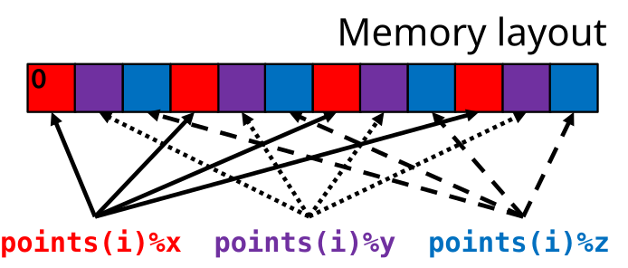

# User defined data types{.section}

# Outline

- Defining own datatypes
- Scope of definitions
- Using datatypes
	- Nested types
	- Memory layout

# What is a derived data type?

- Derived data type is a data structure composed of built-in data
  types and possibly other derived data types
    - Equivalent to structs in C programming language
- Derived type is defined in the variable declaration section of
  program unit
    - Not visible to other programming units
    - Normally, should be defined in a module and used via the use
      clause

# What is a derived data type?

- For real-world applications, using only intrinsic types is often
  insufficient
- It is beneficial to group the data together as larger objects
    - Code becomes easier to read and maintain
    - Fewer arguments to procedures
    - Encapsulation of data
- Variables used in the same context should be grouped together using
  modules and derived data types

# Derived type declaration

- Type declaration 

``` fortran
type particletype
  real :: x 
  real :: y
  real :: z
  integer :: charge 
end type particletype
```

- Declaring a variable with a type 

``` fortran
type(particletype) :: proton, sodiums(300)
```

- Elements are accessed with **`%`** operator 

``` fortran
write(*,*) proton % charge
```

# Visibility of derived datatypes (scoping)

- When declared in the same programming unit, derived data types are
  visible to that unit only
- When declared in a module unit, a derived data type can be accessed
  and used outside the module through **use** statement
<!--
- Visibility can be controlled in more detailed level using
  **private** attribute
    - For example, it is possible to limit the access to part of the
      fields only to the module procedures in the same module where
      the type is defined -->

# Derived type initialization

- Data type initialization 

``` fortran
sodiums(1) = particletype(0.75, 0.19, 0.0, 1)
sodiums(2) = particletype(0.0, -0.38, 0.0, 8) 
sodiums(3) = particletype(-0.75, 0.19, 0.0, 1) 
! or elementwise
sodiums(1) % x = 0.75 
sodiums(1) % y = 0.19 
sodiums(1) % z = 0.0
```

# Nested derived types

- Derived types can contain other derived types as components 

``` fortran
type moleculetype 
  type(particletype), allocatable :: atoms(:) 
  real :: mu
end type moleculetype 
!... 
type solvent 
  type(moleculetype), allocatable :: fluid(:)
  complex :: epsilon 
end type solvent
```

- Access as 

``` fortran
beverage % fluid(1) % atoms(1) % x = 0.75
```

# Data structures: memory layout

<div class="column">
**Array of Structures**

``` fortran
type point 
  real :: x, y, z
end type point

type(point), allocatable :: points(:)

allocate(points(N))
```
</div>
<div class="column">
**Structure of Arrays**

``` fortran
type point 
  real, allocatable :: x(:) 
  real, allocatable :: y(:) 
  real, allocatable :: z(:)
end type point

type(point) :: points

allocate(points%x(N), & 
         points%y(N), & 
         points%z(N))
```

</div>

# Data structures: memory layout

<div class="column">
**Array of Structures**

``` fortran
integer :: i, j
real :: dist(4,4)
do i = 1, 4
  do j = i, 4 
    dist(i,j) = sqrt( & 
      (points(i)%x-points(j)%x)**2 + &
      (points(i)%y-points(j)%y)**2 + &
      (points(i)%z-points(j)%z)**2)
  end do
end do
```

<center>

{.center width=70%}

</center>

</div>
<div class="column">
**Structure of Arrays**

``` fortran
integer :: i, j
real :: dist(4,4)
do i = 1, 4
  do j = i, 4 
    dist(i,j) = sqrt( & 
      (points%x(i)-points%x(j))**2 + &
      (points%y(i)-points%y(j))**2 + &
      (points%z(i)-points%z(j))**2)
  end do
end do
```

<center>

{.center width=70%}

</center>

</div>

# Summary

- Derived data types enables grouping of data to form logical objects
- A Fortran program becomes more readable and modular with sensible
  use of derived data types
- Handling of complex data structures such as linked lists or binary
  trees becomes more manageable with use of derived types
- Enables the use of object oriented programming concepts

<!--  LocalWords:  Fortran Fortran multi iso fortran env structs
 -->
